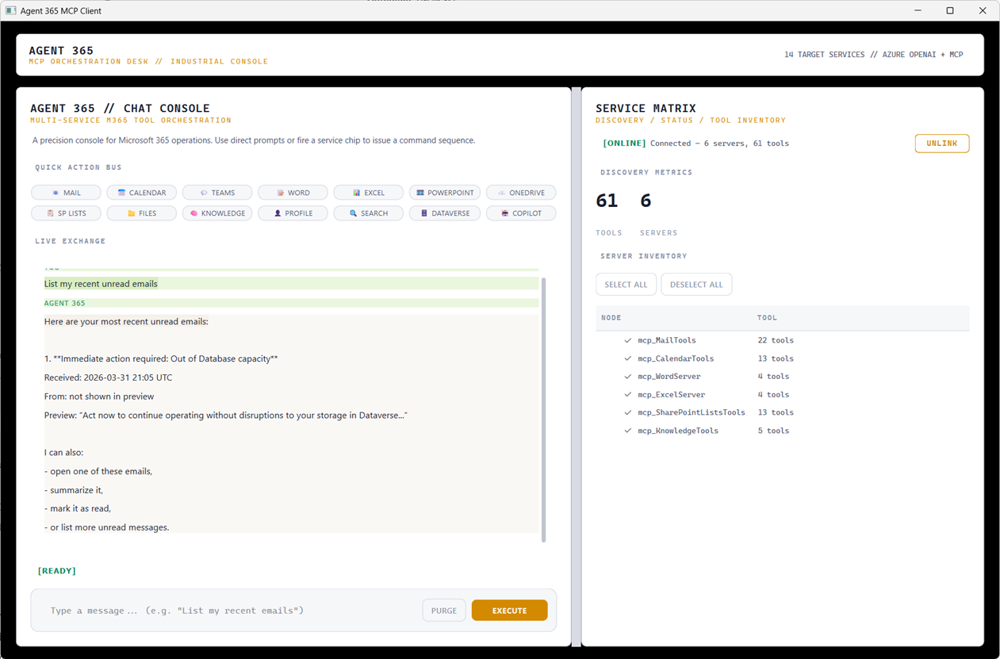
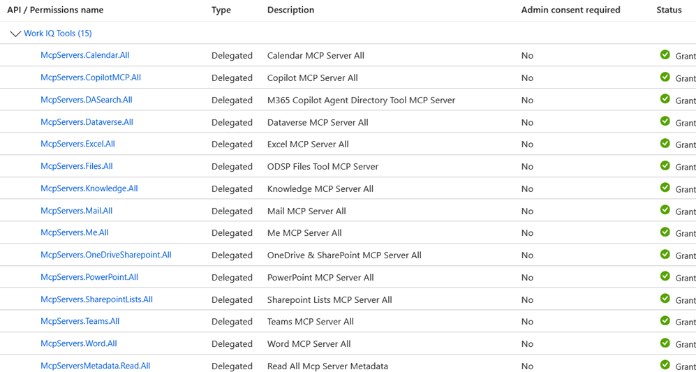

# Agent 365 MCP Client

PySide6 desktop client for exploring and using Agent 365 MCP servers through a single chat UI.



## What It Does

- Connects to 14 Agent 365 MCP servers (Mail, Calendar, Teams, Word, Excel, PowerPoint, OneDrive/SharePoint, Files, Knowledge, Me, Search, Dataverse, Copilot)
- Discovers tools over StreamableHTTP and routes tool calls through a local proxy
- Uses Azure OpenAI for chat and tool-calling
- Provides quick-action buttons for common Microsoft 365 tasks
- Shows discovered servers and tools in the side panel

## Prerequisites

- Python 3.13+
- [uv](https://docs.astral.sh/uv/) package manager
- [A365 CLI](https://learn.microsoft.com/en-us/microsoft-agent-365/developer/reference/cli/) (for agent setup)
- Azure OpenAI deployment
- [Frontier Preview enrollment](https://adoption.microsoft.com/copilot/frontier-program/) for Agent 365 access

## Setup

### 1. Create and register an Agent 365 agent

```bash
a365 config init                         # interactive wizard → creates a365.config.json
a365 develop add-mcp-servers <name>      # adds MCP servers → generates ToolingManifest.json
a365 setup blueprint                     # creates Entra blueprint app
a365 setup permissions mcp               # grants MCP OAuth2 permissions
```

This creates:
- An **agent blueprint app** in Entra ID
- A `ToolingManifest.json` file that records tenant and MCP server metadata for that agent

`ToolingManifest.json` is not generated by this desktop app. It is produced by `a365 develop add-mcp-servers` and then read by this app at startup for default tenant, blueprint, endpoint, scope, and server metadata.

Entra objects used by this project:
- **Agent blueprint app**: created by `a365 setup blueprint`; used for gateway discovery headers and agent-scoped metadata lookup
- **MCP desktop client app**: created manually in Entra; placed in `MCP_CLIENT_ID`; used for interactive `device-code` authentication
- **Tenant**: comes from `MCP_TENANT_ID`, or falls back to `ToolingManifest.json` if omitted

### 2. Create a dedicated Entra app registration for device-code auth

The blueprint app created by `a365 setup blueprint` cannot do interactive (delegated) auth — it's a special `agentIdentityBlueprint` type. You need a standard Entra app registration:

1. Go to **Entra ID** → **App registrations** → **New registration**
2. Name: anything (e.g. "MCP Desktop Client"), single tenant, no redirect URI
3. Under **Authentication** → set **Allow public client flows** to **Yes**
4. Add the Agent 365 delegated permissions using one of these paths:
   - **API permissions** → **Add a permission** → **APIs my organization uses**, search `Work IQ Tools` (`ea9ffc3e-8a23-4a7d-836d-234d7c7565c1`), then add the delegated scopes below
5. Required **Delegated** permissions:
	- `McpServers.Calendar.All`
	- `McpServers.CopilotMCP.All`
	- `McpServers.DASearch.All`
	- `McpServers.Dataverse.All`
	- `McpServers.Excel.All`
	- `McpServers.Files.All`
	- `McpServers.Knowledge.All`
	- `McpServers.Mail.All`
	- `McpServers.Me.All`
	- `McpServers.OneDriveSharePoint.All`
	- `McpServers.PowerPoint.All`
	- `McpServers.SharepointLists.All`
	- `McpServers.Teams.All`
	- `McpServers.Word.All`
	- `McpServersMetadata.Read.All`
6. Click **Grant admin consent**  
   	  
7. Copy the **Application (client) ID** — this is your `MCP_CLIENT_ID`

See [docs/mcp-server-access-issue.md](docs/mcp-server-access-issue.md) for the full auth story and why this is necessary.

### 3. Configure environment

```bash
cp .env.template .env
```

Edit `.env`:

```env
# Required for MCP auth
# Public client app registration used only for device-code sign-in
MCP_CLIENT_ID=<your-mcp-desktop-client-app-id>

# Required unless you want to inherit tenantId from ToolingManifest.json
MCP_TENANT_ID=<your-azure-tenant-id>

# Recommended for full 14-server access
MCP_AUTH_MODE=device-code

# Required — Azure OpenAI
AZURE_OPENAI_ENDPOINT=https://<your-resource>.cognitiveservices.azure.com/
AZURE_OPENAI_AUTH_MODE=azure-cli
AZURE_OPENAI_DEPLOYMENT=gpt-5.4-mini
AZURE_OPENAI_API_VERSION=2025-04-01-preview
```

### 4. Install and run

```bash
uv sync
uv run mcp-client
```

On first connect, a browser opens for device-code sign-in. After that, credentials are cached silently.

## Auth Modes

| Mode | All 14 servers? | Notes |
|------|:---:|-------|
| `device-code` | **Yes** | Interactive public client flow — recommended |
| `azure-cli` | 3 only | `az login` token lacks most MCP scopes |
| `a365-cli` | 3 only | Same limitation as azure-cli |
| `client-secret` | No | App-only tokens have `roles`, not `scp` — MCP servers reject them |
| `bearer` | Depends | Pass-through; works only if the token already has the right scopes |
| `auto` | Varies | Tries each in order: bearer → a365-cli → device-code → fallback |

## Optional Config

```env
AGENTIC_APP_ID=              # Optional override for the blueprint app ID used in gateway discovery; normally inherited from ToolingManifest.json
MCP_PLATFORM_ENDPOINT=       # Default: https://agent365.svc.cloud.microsoft
MCP_PLATFORM_AUTH_SCOPE=     # Default: ea9ffc3e-8a23-4a7d-836d-234d7c7565c1/.default (well-known Agent 365 Tools resource)
MCP_CLIENT_SECRET=           # Only for client-secret auth mode
MCP_BEARER_TOKEN=            # Static token override
```

## VS Code Debugger

Use a Python launch configuration with the workspace `.env` file and the project root as the working directory.

Recommended `.vscode/launch.json`:

```json
{
	"version": "0.2.0",
	"configurations": [
		{
			"name": "Agent 365 MCP Client",
			"type": "debugpy",
			"request": "launch",
			"module": "mcp_client",
			"cwd": "${workspaceFolder}",
			"envFile": "${workspaceFolder}/.env",
			"console": "integratedTerminal",
			"justMyCode": true
		},
		{
			"name": "Agent 365 MCP Bridge",
			"type": "debugpy",
			"request": "launch",
			"module": "mcp_bridge",
			"cwd": "${workspaceFolder}",
			"envFile": "${workspaceFolder}/.env",
			"console": "integratedTerminal",
			"justMyCode": true
		}
	]
}
```

Required debugger inputs:
- `.env` present in the workspace root
- `ToolingManifest.json` present in the workspace root, unless you fully override tenant, endpoint, scope, and blueprint values via environment variables
- Python environment selected in VS Code with project dependencies installed via `uv sync`

## Entry Points

| Command | Description |
|---------|-------------|
| `uv run mcp-client` | Desktop GUI |
| `uv run mcp-bridge` | MCP stdio server (for Claude Code, VS Code agents) |
| `uv run python -m mcp_client` | Alternative GUI launch |
